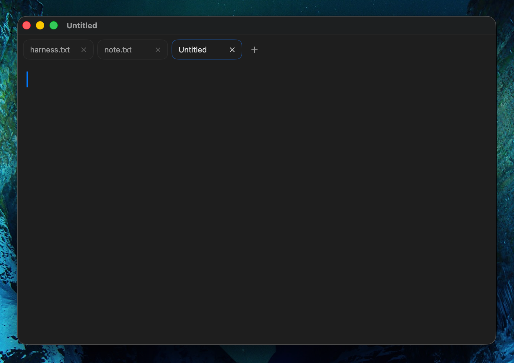

# mac-notepad

`mac-notepad` is a small native macOS plain-text editor built with SwiftUI and a lightweight web-based editor surface.

It keeps the app intentionally simple: plain text only, manual save/open, lightweight tabs, adjustable font and line height, word wrap, and a minimal Mac-style UI.



## Features

- Native macOS app with a standalone `.app` bundle build script
- Plain-text editing with no rich text, preview, sidebar, or autosave
- Multiple tabs in one window
- Adjustable font, font size, line height, and word wrap
- Lightweight find/replace bar
- Drag-and-drop `.txt` opening
- Built-in Myanmar font options for Burmese text
- `.txt` file association support for Finder and `Open With`

## Build

```bash
swift test
./scripts/build_app.sh
open dist/Notepad.app
```

To verify the app is portable after copying to `/Applications`, run:

```bash
./scripts/verify_portable_app.sh
```

## Quick Test

If you just want to try the app without building it yourself, the repository also includes a ready-to-run copy at `dist/Notepad.app`.

After cloning the repo:

```bash
open dist/Notepad.app
```

## Tech

- Swift Package Manager
- SwiftUI for app structure and tab UI
- `WKWebView` + CodeMirror for the editing surface
- AppKit for native macOS windowing, menus, and file integration
